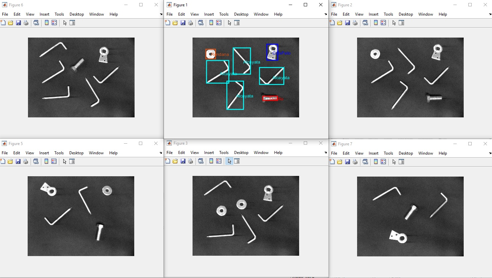

# Clasificador
Clasificador de imágenes que detecta objetos (tornillos, rondanas, alcayatas, gancho y cola de pato) utilizando el clasificador de mínima distancia.

El programa se encarga de detectar los objetos que se encuentran en la imagen además de mostrar las 6 imágenes mas parecidas dentro de la base de datos de entrenamiento.

Este trabajo fue realizado en la clase de Pattern Recognition en la Escuela Superior de Computo (IPN).

